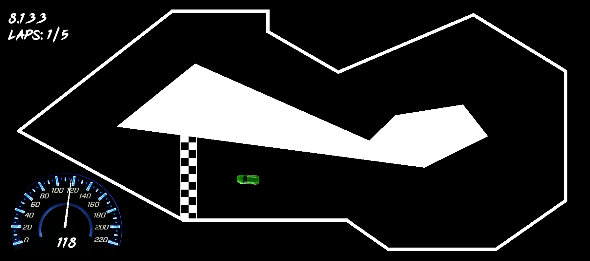

# Racing Game with AI learning agent

## General info

#### Game
This project contains racing game. It is simple 2D game with top-down perspective. The game is specially designed for AI learning and it has necessary mechanics for this task. What is more, superior goal was performance of this application. It was needed, because AI have to play that game a lot of times to learn how to control. The project contains 1200 lines in C++ and it uses SFML library.

#### Artificial Intelligence
Project includes two AI algorithm, that learn how to play the game. Both are written in Python and use Keras library. Imitation Learning works like Supervised Learning and it tries to learn from aggregated expert's trajectories. Evolution strategies learn how to play from scratch, just by changing weights of the net and testing reward value from environment. AI algorithms contains 300 lines of code in Python.

#### Communication
Python script communicates with executable game file by pipe mechanism. Both softwares uses input and output buffors. C++ sends current state, while Python receives it and send back predicted control from the neural network net.

## Technologies

Project is created with:
* C++ version: 17
* SFML version: 2.4.2
* Python version: 3.6
* Keras version: 2.0.8

## Setup
To run the game, compile three cpp files with two headers.
To run AI Learning, Keras library is needed. Then agent is ready to learn from two of AI methods: 
* imitationLearning.py, which is using input.txt as trajectory of an expert 
* evolutionStrategy.py, which learns from scratch
Both methods are using three executable files of the game, which are located in the same directory. 